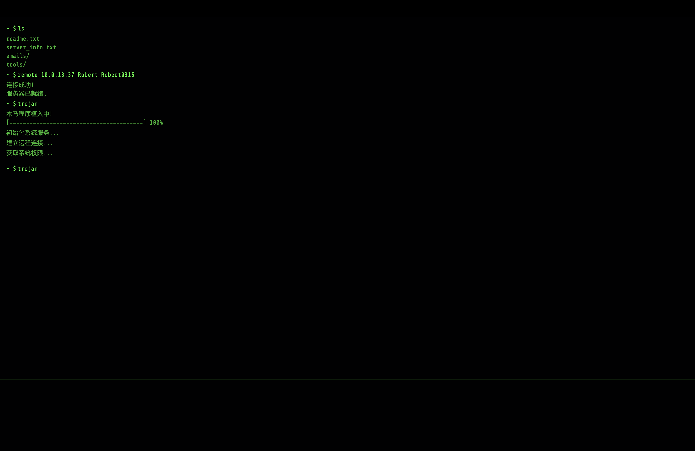
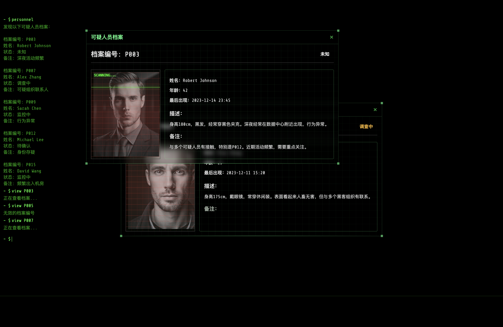

# The Last Crack

一个基于终端的黑客解谜游戏。

## 游戏截图

### 主菜单


### 游戏界面








## 项目说明

这是一个模拟黑客入侵的解谜游戏，玩家需要通过各种终端命令和技巧来完成每一关的挑战。游戏包含多个关卡，每个关卡都有不同的主题和难度。

## 项目架构

```text
TheLastCrack/
├── src/                        # 源代码目录
│   ├── assets/                 # 静态资源
│   │   ├── fonts/             # 字体文件
│   │   ├── images/            # 图片资源
│   │   └── sounds/            # 音效文件
│   ├── components/            # Vue组件
│   │   ├── MainMenu.vue       # 主菜单组件
│   │   ├── Terminal.vue       # 终端组件
│   │   └── ConfettiEffect.vue # 特效组件
│   ├── game/                  # 游戏核心逻辑
│   │   ├── commands/          # 终端命令
│   │   │   ├── basic.ts       # 基础命令
│   │   │   ├── gameComplete.ts# 游戏完成
│   │   │   └── index.ts       # 命令注册
│   │   └── levels/           # 关卡配置
│   │       ├── configs/      # 各关卡数据
│   │       └── index.ts      # 关卡管理
│   ├── stores/               # 状态管理
│   │   ├── game.ts          # 游戏状态
│   │   ├── terminal.ts      # 终端状态
│   │   └── save.ts          # 存档管理
│   ├── types/               # 类型定义
│   │   ├── game.ts         # 游戏类型
│   │   └── terminal.ts     # 终端类型
│   ├── App.vue             # 根组件
│   └── main.ts             # 入口文件
├── public/                 # 公共资源
├── .env                   # 环境变量
├── .env.example          # 环境变量示例
├── package.json          # 项目配置
└── README.md             # 项目说明
```

## 环境变量配置

项目使用 `.env` 文件来管理全局配置，主要包含以下变量：

### 版本信息
- `VITE_APP_VERSION`: 当前版本号 (例如: 1.0.1)
- `VITE_APP_COPYRIGHT`: 版权信息
- `VITE_APP_SERIAL`: 序列号

### 游戏配置
- `VITE_APP_LAST_LEVEL`: 最后一关的关卡号
- `VITE_APP_NAME`: 游戏名称
- `VITE_APP_AUTHOR`: 作者信息

## 开发说明

1. 克隆项目后，复制 `.env.example` 为 `.env`
2. 根据需要修改环境变量
3. 运行开发服务器：
   ```bash
   npm install
   yarn
   npm run dev
   yarn dev
   ```

## 许可证

MIT License 